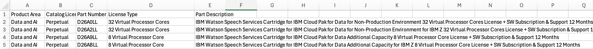

# Data Proprocessing

## 1. Introduction
Data preprocessing is a crucial step in implementing Retrieval Augmented Generation (RAG) functionality, as it enables the transformation of raw data into a structured and contextualized format that can be effectively processed by Large Language Models (LLMs). This process involves a series of steps, including data merging, contextualizing, and preparation, to ensure that the input data is accurate, consistent, and suitable for RAG analysis. By preprocessing the data, we can unlock the full potential of LLMs and Watson Discovery, enabling more accurate and reliable results in RAG-related applications.
## 2. Input Data
- Multiple Excel sheets with product information
- Columns: Product Family, Part number, description, license metric, and other relevant data
- This is an example excel sheet with product number and product description

## 3. Data Merging
- Merging multiple Excel sheets into a single dataset
- Importance of data consistency and accuracy
    - beware of spaces in data (e.g. "Yes" vs "Yes ")
## 4. Contextualizing Data for LLM and RAG
- When a CSV file is uploaded to Watson Discovery, each row is transformed into a JSON object, allowing for efficient processing and analysis. However, for RAG use cases, the data can be scattered and fragmented, making it challenging for Large Language Models (LLMs) to process effectively. 
- To address this limitation, we developed a custom data pipeline that transforms all columns of data into a single paragraph of information. This pipeline enables the creation of a cohesive and structured input for LLMs, facilitating more accurate and reliable processing of RAG-related data.

### For example
- This is an example excel sheet with product number and product description

- The custom data pipeline we developed concatenates columns into a single paragraph to create a contextualized representation of product data, as screenshot below.

- Further information could also be found [here (IBM Product Search)](https://www.ibm.com/about/software-licensing/us-en/product_search?search=D26ABLL&type=all&platform=)
## 5. Preparing Data for Watson Discovery
- Saving data as CSV files as Watson Discovery separates each CSV row into independent documents that could then be used for RAG and LLM Search.
## 6. Conclusion
- Recap of data preprocessing steps 