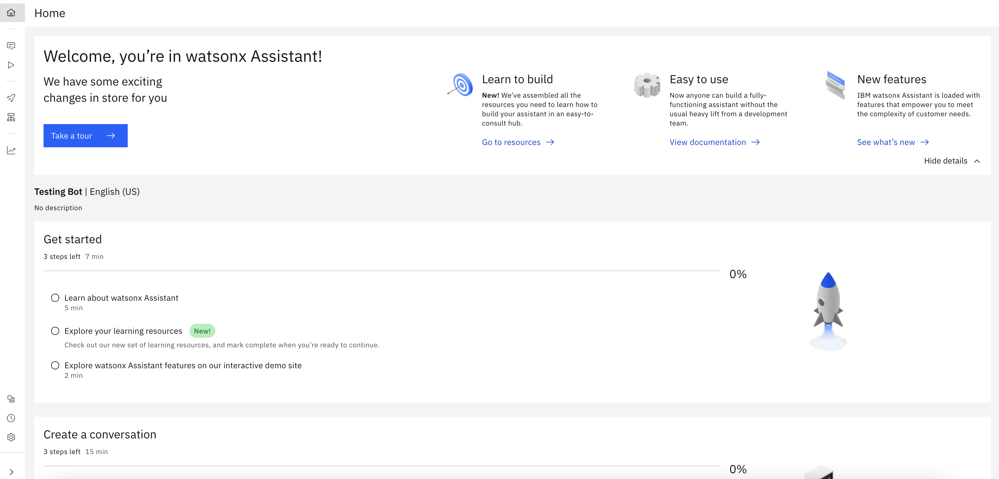
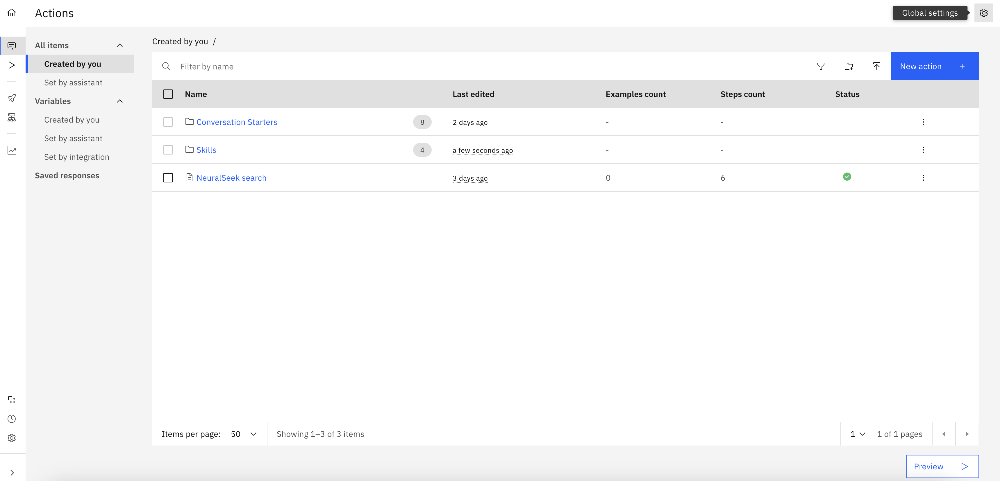
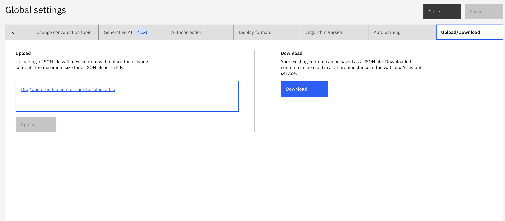
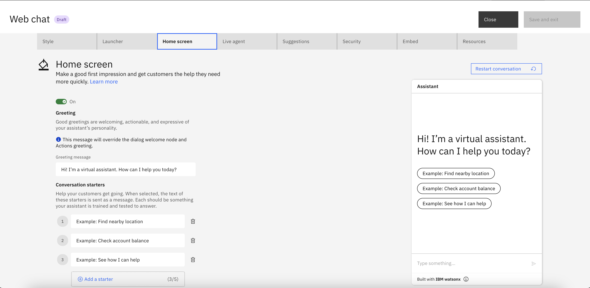
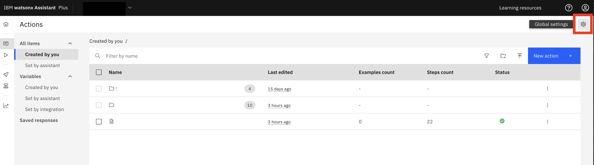
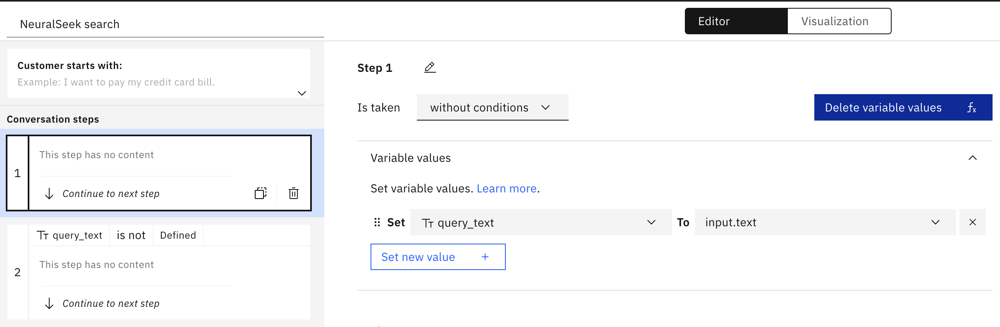

# Watsonx Assistant Setup

Details regarding the technical solution on how we configured Watsons Assistant to enable Core capabilities. 
- Some examples of Key capabilities are:
    - Ask a Question
    - Licensing Information
    - Current Catalog Consumption
- Here's a preview of what AskCSM Homepage could look like!
    - 
- Here's an example interaction of what AskCSM could help you with!
    - 

## 
### Pre-Requisites
- Access to watsonx Assistant

## Let's Create a new Assistant!
1. When you first launch the experience, you’ll be prompted to create your first assistant: 
    - Give it a name that represents the domain of topics you want it to handle. 
    - Choose what language you want it to speak before continuing. watsonx Assistant can handle virtually any global language.

1. From here, you’ll start on the home page of your brand-new assistant:

1. Now it’s time to build your first conversation. Follow along with our example or create your own!
- Reference: [Getting started with watsonx Assistant part I: the build guide](https://www.ibm.com/blog/getting-started-with-the-new-watson-assistant-part-i-the-build-guide/?c=Watson%20Assistant)
## Upload/Download actions
To reinstate a backup copy of actions that you exported from another service instance or environment, import the JSON file of the actions you exported.
1. On the Actions page, click Global settings Gear icon on upper-right corner.

1. To upload: On the Upload/Download tab, drag and drop a JSON file onto the tab or click to select a file from your local system, then click Upload.
1. To download: On the Upload/Download tab, click on the "Download" button to export action.json file.

- Reference: [Uploading or downloading all actions](https://cloud.ibm.com/docs/watson-assistant?topic=watson-assistant-upload-download-actions)

## Create Custom Extension: NeuralSeek

### Pre-Requisites
- Access to NeuralSeek instance that has been integrated with Watson Discovery and watsonx.ai
### Create NeuralSeek custom extension 
1. In Watson Assistant, on the "Integrations" tab of Watson Assistant, click "Build Custom Extension" then "Next".
2. Name the extension "NeuralSeek" and give a brief description. Click "Next".
3. Open another browser tab and navigate to NeuralSeek -> "Integrate" tab -> Download "Custom Extension OpenApi File".
4. Navigate to Watson Assitant browser tab. Upload NeuralSeek OpenApi file into Waston Assiatant. Click "Next" then "Finish".
5. On the new "NeuralSeek" extension tile that appears, click "Add", "Add", then "Next".
6. On the authentication screen, select "API key auth", and enter your api key as shown in NeuralSeek "Integrate" page.
7. Click "Next", "Finish", then "Close".

### Create WA action to trigger NeuralSeek Search 
1. On the "Actions" tab of Watson Assistant, click "Create Action". Choose "Quick Start with templates", then select  "NeuralSeek Starter Kit" -> "Select this starter kit" -> "Add templatess".
1. Open the "NeuralSeek Search" action.
1. In step 3, in the "And then" section, click "edit extension", 
    - in the Extension dropdown select "NeuralSeek"
    - in the Operation dropdown select "Seek an answer from NeuralSeek".
1. Set parameters. 
    - Set `question` To `query_text`. 
    - Set `user_session.system.session_id` to Expression `context.system.session_id`.
    - Set `options.includeSourceResults` to `True`
1. "Save" and "Close" action

Extension setup will look similar to screenshot below

#### No action matches Setup
1. Navigate to "All items" -> "Set by assistant" -> "No action matches".
1. Click on the "No action matches" action and delete existing steps.
1. Click "New Step". In the "And then" section, select "go to a subaction"  -> select "NeuralSeek Search" in the dropdown options -> "Apply".
1. "Save" and "Close"

- References: [Integrate NeuralSeek with Watson Assistant and Watson Discovery](https://developer.ibm.com/tutorials/integrate-neuralseek-with-watson-assistant-and-watson-discovery/)

## Modify AI Assistant
### Conversation Starters
1. Navigate to the "Preview" tab. Click the blue "Customize web chat" button.

1. Navigate to the "Home screen" tab. Modify the Greeting messages and Conversation Starters to match frequently asked questions.

## Advanced Watsonx Assistant Configuration
### Autocorrection
- To tackle typos, we leveraged watsonx assistant capability of Autocorrection.
- To enable this feature, navitate to Actions -> All items -> Created by you. Click "Global Settings" on the upper right corner.

- Navigate to the Autocorrection tab and make sure the toggle is switched to on.

- **In NeuralSeek Search action, set query_text to expression `input.text`**. This will allow the autocorrected input to be passed to NeuralSeek extension. Originally, query_text was set to expression `input.original_text`, if users entered typos, the typoed text would be passed to NeuralSeek. 

- Reference: [Correcting user input](https://cloud.ibm.com/docs/assistant-data?topic=assistant-data-dialog-runtime-spell-check)
