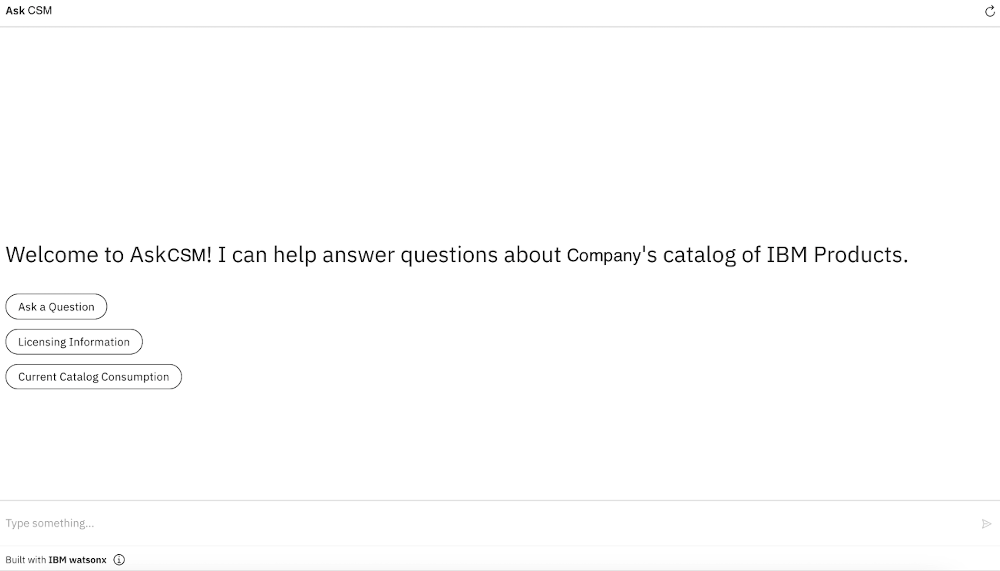
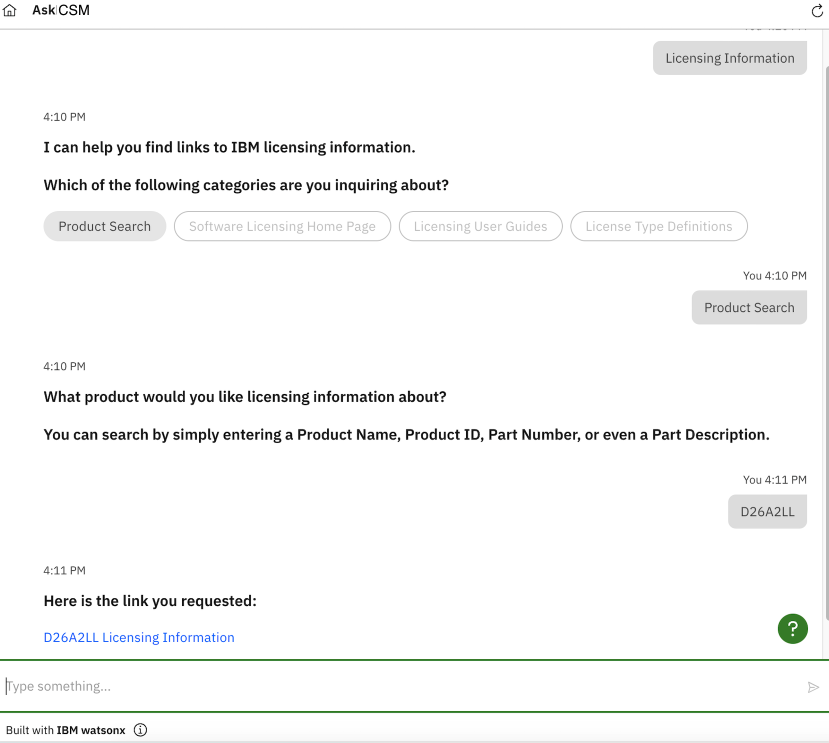

# Watsonx Assistant Setup

Details regarding the technical solution on how we configured Watsons Assistant to enable Core capabilities. 
- Some examples of Key capabilities are:
    - Ask a Question
    - Licensing Information
    - Current Catalog Consumption
- Here's a preview of what AskCSM Homepage could look like!
    - 
- Here's an example interaction of what AskCSM could help you with!
    - 

i.e. Deployment, installment, upgrade, configuration, automation.
