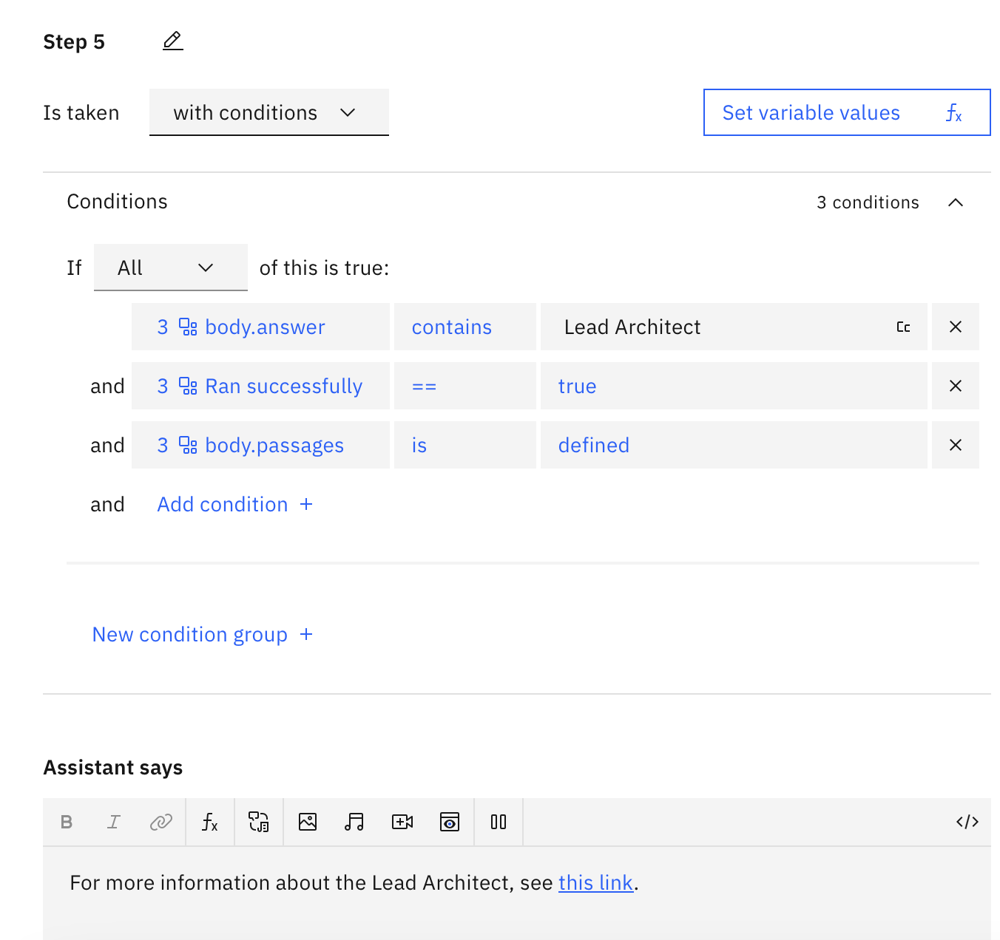
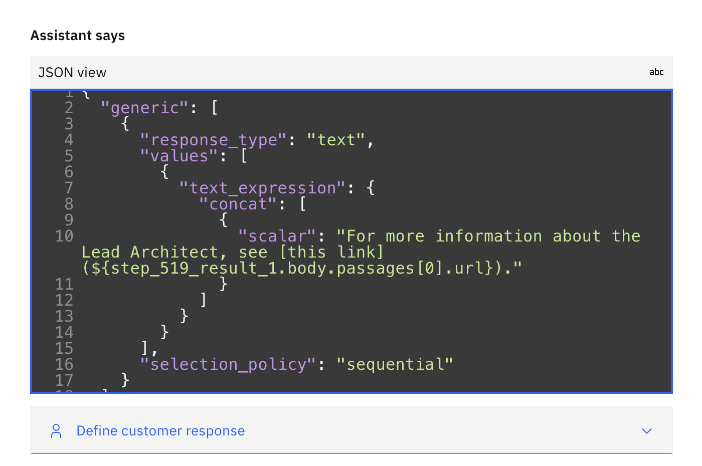

# Source Attribution

Details regarding the technical solution on how we configured Watsonx Assistant and NeuralSeek to enable Source Attribution, to display clickable links to the users.
In NeuralSeek under Knowledgebase Connection, make sure to have the following fields:
    - Curation Data Field: text
    - Link Field: url
    - Document Name Field: extracted_metadata.title
    - Attribute sources inside LLM Conext by Document Name: Enabled
    - Return the full document instead of passages (only enable this if all of your documents are short): Enabled

In watsonx asssitant, we can create a specific action step that will display the corresponding URL when a keyword is mentioned by the user.
An example is that we can have a condition that if body.answer contains 'Lead Architect', a specific step is ran succesfully, and body.passages is defined, then we can have the assistant reply with the corresponding link from the LLM response.

Toggle to the JSON view to ensure the accessing the URL information is correct. In this case, it is `${step_519_result_1.body.passages[0].url}`.
